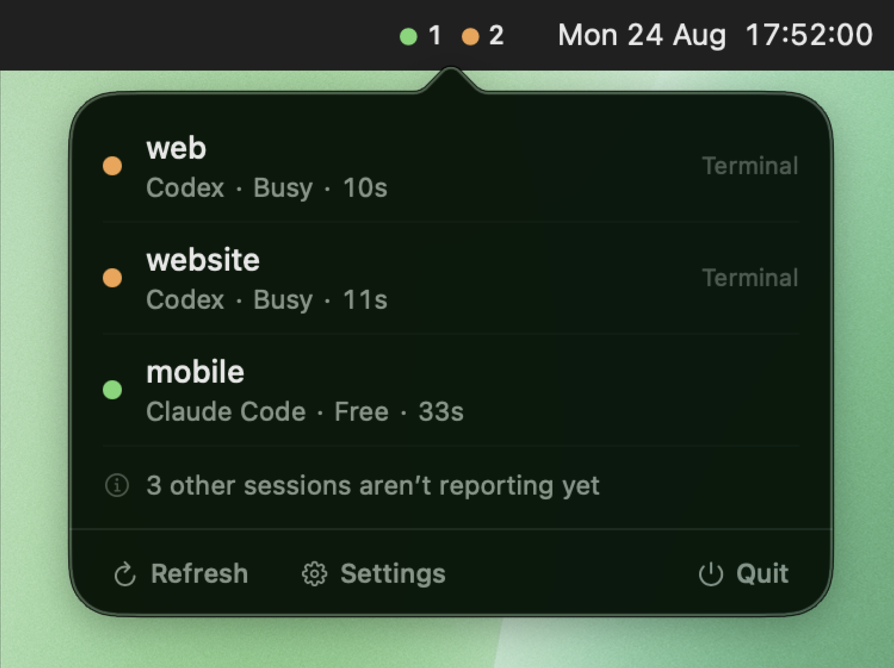

<div align="center">

# CodeStatus

**Stop watching AI work.**

A macOS menu bar app that tracks every Claude Code and Codex session on your Mac and tells you
the moment one finishes, needs approval, or is waiting on you. A native presence layer for coding
agents: start several, keep working, and come back only when one is actually done or actually
needs you.



[**Download for macOS**](https://github.com/henriquegpb/codestatus/releases/latest/download/CodeStatus.dmg) ·
[Download for Windows](https://github.com/henriquegpb/codestatus/releases/latest/download/CodeStatus-Setup.exe) ·
[codestatus.dev](https://codestatus.dev)

macOS 14 or later · Windows 10 or later · MIT · no account, no server, no telemetry

</div>

---

## What it is

You run Claude Code in one terminal, Codex in another, maybe a third in VS Code. Then you spend
the next twenty minutes tabbing between them asking "is it done yet?".

CodeStatus answers that without you looking. It tracks every Claude Code and Codex session on
your Mac, works out whether each one is *working*, *free*, *waiting for your approval*,
*waiting for an answer*, or *failed*, and shows the counts in the menu bar — with a
sound and a notification the moment one needs you.

```
● 1 free            ● 2 busy            ● 1 needs you
```

Click a session and you land back in the right terminal tab or the right workspace.

## What it is not

It is not a prettier Activity Monitor, and it is not a wrapper around notifications.

Watching whether `claude`, `codex`, or `node` is burning CPU tells you nothing about whether the
agent is thinking, running a tool, or sitting idle waiting for you. CodeStatus uses the agents'
**official lifecycle hooks** as the source of truth. Process observation is used only for
discovery, enrichment, and knowing when a session genuinely died.

If we cannot determine a state, we show `Unknown` or `Reconnecting`. We never announce that a
session finished because it went quiet.

## Platforms

Two apps, one repository. They are separate implementations of the same product and share no
build, no dependency, and no runtime.

| | macOS | Windows |
|---|---|---|
| Where | repository root | [`windows/`](windows/) |
| Built with | Swift 6, AppKit/SwiftUI | Node.js, Electron |
| Status | in daily use | ported, needs hardware verification |
| Agents | Claude Code, Codex | Claude Code |

```
Package.swift  Sources/  Tests/  scripts/  Resources/   ← macOS
windows/                                                ← Windows
website/  docs/                                         ← shared
```

The macOS app is the reference implementation: the state machine, the event vocabulary, and the
honesty rules are defined there and ported. What keeps the two from drifting is that the test
suites are written as the same cases in both languages — see
[windows/README.md](windows/README.md#two-apps-one-repository), which explains how that drift
happened once already and what it cost.

Linux is not supported. The port is cheap — Node's `net` gives Unix sockets with the same API,
and `src/core/` has no platform in it — but GNOME removed the system tray and Wayland has no way
to raise another application's window, so the premise of the app is only half available on the
most common desktop.

## Privacy

Everything happens on your Mac. There is no account, no server, no telemetry, and no network
code in the product at all.

The privacy guarantee is structural rather than a promise. The hook binary that agents invoke
never parses your payload into a general structure — it walks past everything that is not on a
metadata allowlist without ever copying those bytes. Your prompts, the agent's responses, tool
inputs and outputs, and transcript paths are *incapable* of reaching the socket, the logs, or
the crash reporter, and there is a test that asserts exactly that.

What we do read: session id, provider, event name, timestamp, pid, tty, working directory, git
root, workspace name, and host application.

## Status

**In development.** The engine is built and covered by 184 tests. The interface works and is in daily use; its appearance has not been reviewed on hardware other than one machine.

| Area | State |
|---|---|
| State machine, event ordering, de-duplication | done, tested |
| Hook binary, Unix socket transport, spool fallback | done, tested |
| Session registry, persistence, sleep/wake reconciliation | done, tested |
| Config installers (byte-preserving), process watcher | done, tested |
| Menu bar item, notifications, session opening | built, needs visual verification on hardware |
| Diagnostics report and sanitised export | done, tested |
| Onboarding flow, settings window | done |
| Signed and notarised release pipeline | scripted; notarisation not yet exercised |

Verified working end to end on a real machine: the app launches as a menu bar
companion, creates its runtime directories `0700`, listens on the socket, installs
its hook binary, and correctly takes a session from `busy` to `free` from real hook
invocations — while leaving `~/.claude/settings.json` and `~/.codex/config.toml`
untouched and keeping prompt and response text out of every artefact it writes.

In the same run the process watcher independently found the Claude Code and Codex
processes already running on the machine and reported them as `unknown` rather than
guessing — which is the behaviour this project exists to get right.

## Capability matrix

Limitations are stated, not hidden. This is what we can actually do per environment.

| Environment | Discovery | Busy/free | Approval | Input | Open | Send prompt |
|---|---|---|---|---|---|---|
| Claude Code CLI | yes | yes | yes | yes | yes (tab) | no |
| Claude Code in VS Code | yes | yes | yes | yes | yes (workspace) | no |
| Codex CLI | yes | yes | yes | **no** | yes (tab) | no |
| Codex in VS Code | yes | *unverified* | *unverified* | **no** | yes (workspace) | no |

Why the gaps:

- **Codex "Input" is no.** Codex has no `Notification` event, so "the agent is waiting for you
  to answer a question" is not observable through any official channel. Approval requests *are*,
  via `PermissionRequest`.
- **A session you interrupt keeps its last state until you type again.** Claude Code's `Stop`
  hook deliberately does not run when *you* stop a turn, and no other event takes its place —
  verified across every shape of cancel, with all 31 of its hook events registered. So pressing
  Esc on a question leaves CodeStatus showing "needs a reply" until your next prompt. We would
  rather be briefly wrong than guess a session went free while its question is still on screen.
  See [spike 13](docs/spikes/07-blocking-questions.md).
- **Codex sees only the first tool use of each turn.** Its hook payloads carry no `tool_name` or
  `tool_use_id`, so tool uses cannot be told apart and the ones after the first are dropped as
  out-of-order — which means an approval Codex asks for late in a turn is missed. Claude Code
  supplies both and does not have this problem.
- **Codex in VS Code is unverified.** It runs as `app-server` rather than the TUI, and it has
  not yet been confirmed that `hooks.json` events are delivered in that mode.
- **"Send prompt" is no everywhere, for now.** Typing into a session we did not launch would
  mean writing to a TTY or faking keystrokes, which can land your text in the wrong place. It
  will be enabled only for sessions CodeStatus starts itself through a PTY.

## Updates

CodeStatus updates itself, and tries hard not to be noticed doing it.

Once a day it asks GitHub what the latest release is. If there is a newer one it
downloads it, checks that the bundle declares the version it promised, and verifies the
signature against the Developer ID team of the app that is *running* — nested code included, so a
tampered `codestatus-hook` cannot ride along. Only after all of that passes does anything on disk
change.

Then it waits. The swap happens when no agent is working or waiting on you, and the app restarts
into the new version. That costs nothing: sessions live in the agents, their hooks point at a
binary staged outside the bundle, and the snapshot is reloaded on launch. If your machine is
never quiet, the menu bar offers a Restart button and you pick the moment.

It disables itself, visibly, when it cannot do this safely: a build that is not Developer ID
signed, or an app running from a disk image or a translocated path. Turn the whole thing off in
Settings.

## How it works

```
Claude Code / Codex
        │  official lifecycle hook (async, never blocking)
        ▼
codestatus-hook          ← metadata allowlist applied here, 225 KB universal, no Foundation
        │  one NDJSON line over a Unix domain socket
        ▼
CodeStatus daemon
        │
        ├── StateReducer      pure, idempotent, tolerant of out-of-order delivery
        ├── SessionRegistry   the single source of truth
        └── ProcessWatcher    kqueue NOTE_EXIT — discovery and death, never state
                │
                ▼
        menu bar · sound · notification
```

Three design choices carry most of the weight:

1. **Hooks are registered with `async: true`.** An async hook cannot block, approve, deny, or
   alter the agent's flow — so "CodeStatus never interferes" is enforced by the agent, not by us
   being careful.
2. **Config edits are byte-preserving text splices.** Installing hooks does not re-serialise
   `settings.json`; every byte outside the inserted entry stays identical, so your formatting and
   key order survive and your own hooks are never touched.
3. **Nothing infers state from time.** A session quiet for ten minutes in the middle of one long
   tool call is still `busy`. Only our *confidence* decays.

## Building

Requires macOS 14+ and Swift 6.

```sh
swift build
swift test
```

Note for contributors: on macOS 26, `UNUserNotificationCenter` will not deliver from an unsigned
bundle — it fails silently. A local build needs at least an ad-hoc signed `.app` before
notifications appear. See `CONTRIBUTING.md`.

## Documentation

- [`docs/spikes/`](docs/spikes/) — the experiments behind every architectural decision, with
  results, limitations, and what each one changed. Start with the
  [index](docs/spikes/README.md).
- [`NOTICE`](NOTICE) — projects whose code we adapted, and what we changed.

## License

MIT. See [`LICENSE`](LICENSE).
